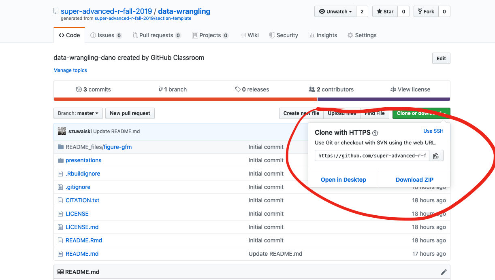
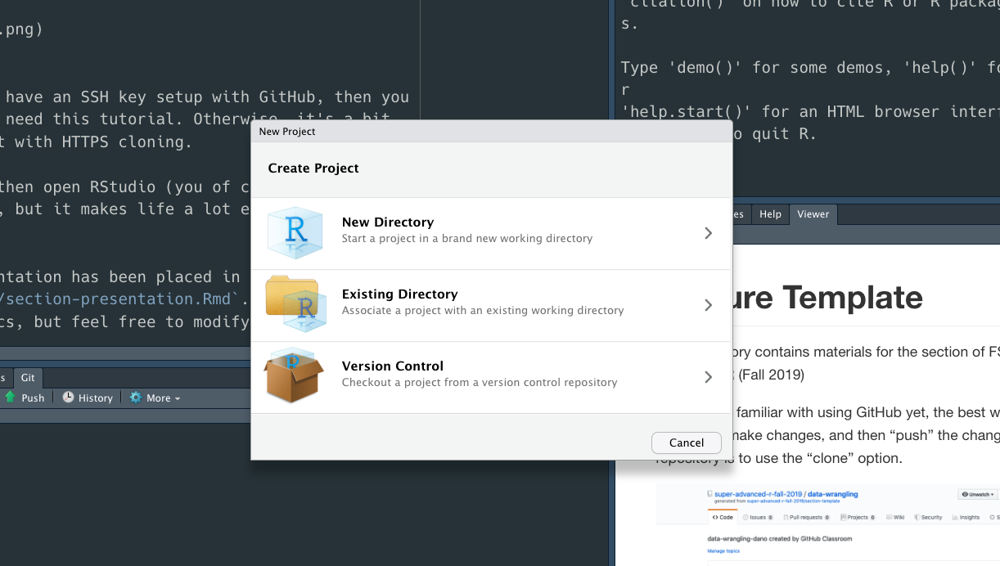

<!-- README.md is generated from README.Rmd. Please edit that file -->

```{r, include = FALSE}
knitr::opts_chunk$set(
  collapse = TRUE,
  comment = "#>"
)
```
# Lecture Template

This repository contains materials for the <YOUR LECTURE HERE> section of FSH 507 - Super-Advanced R (Fall 2019)

Course syllabus available [here](https://docs.google.com/document/d/1S63IHjNBk8e7St6XcyqhVu98qpuRTUx3DHYqzWKYDys/edit?usp=sharing)

Once you've gotten these setup, feel free to replace this README.Rmd file with your own actually describing your repository. 

## Getting Started

The file structure is based on ["Good enough practices in scientific computing"](https://journals.plos.org/ploscompbiol/article?id=10.1371/journal.pcbi.1005510). This can take some getting used, but is worth it, and is incredible easy with the `here` package. `here` figures out path names for you. 

Suppose that I have a .csv file called my_data.csv that I've placed in the data folder, that I then want to load into my presentation. We can use `here` to find the complete path for that file

```{r}
path <- here::here("data","my_data.csv")
path
```

And then just pass that path to read.csv!

```{r,eval=TRUE}
my_data <- read.csv(path)

head(my_data)
```

`here` will work on any operating system, no matter where the project itself is stored, and no matter whether you're in a script or an R Markdown chunk. The key though is organizing your folder so that all the materials you need are in the repo. 

### Getting Things from GitHub

If you're not familiar with using GitHub yet, first make a GitHub account. From there, the best way to download the repository, make changes, and then "push" the changes back to the repository is to use the "clone" option. 




If you already have an SSH key setup with GitHub, then you probably don't need this tutorial. Otherwise, it's a bit easier to start with HTTPS cloning. 

First, if you haven't, [install Git](https://git-scm.com/book/en/v2/Getting-Started-Installing-Git) on your system! From there...

Copy the URL, then open RStudio (you of course don't have to use RStudio, but it makes life a lot easier at this stage). Go to File>New Project. That will create a pop-up window



Select the "Version Control" option. From there, select the 'Git' option, then paste the URL you copied from GitHub into the "Repository URL:" field. Decide on the project directory name (I recommend just the name of the repository itself, e.g. `data-wrangling`, RStudio should fill that in automatically for you). Lastly, select the "Create project as a subdirectory of" option. I recommend creating a folder called "super-advanced-r" or something like that, and creating all of the lecture modules as subdirectories of that directory. 

Click "Create Project" and, so long as you have an internet connection, the project will be cloned to your computer. If you used HTTPS, you'll be asked for your GitHub credentials (username and password). 

If you're thinking "come on, I thought the point of this class was to learn Git, and that's not until week 4!", you can of course just hit "Download ZIP" back on the first step, and that will download all the files. The only downside with that is that the repository won't be automatically linked with the GitHub repository. So you'll have to email me any changes, or link them to your repo at a later date. 

Once you've cloned the repo (assuming you haven't used the zipping option), you're off and running! Your mantra from now on is "commit, pull, push". 

Say you've finished the first part of your presentation and want to publish your changes to the GitHub repo. The easiest way is inside RStudio. Click on the 'Git' tab (next to the Connections tab). You should see a pane with entries for all the files that have changed. Check the "Staged" boxes next to each one. Then, click 'Commit'. This will pop up a window that asks you to write a commit message. This can be something like "Finished the first section of my presentation". Hit 'Commit'. Once you've done that, click "Pull": this "pulls" the current version of the code hosted on GitHub into your current repository, and resolves any differences between the two. Since you'll probably be the only person working on the presentation, nothing should happen here, but it's best practice to get in the habit of always pulling before pushing. Once you've pulled, hit 'Push', and your results will be published to GitHub. If you've used HTTPS you'll have to enter GitHub credentials. 

And that's all. It's easy once you're used to it but takes some practice. I can't recommend Jenny Bryan's ["Happy Git and GitHub for the useR"](https://happygitwithr.com/) enough for a much more thorough intro to Git. 


## Presentations

A sample presentation has been placed in `presentations/section-presentation.Rmd`. I've added a few suggested topics, but feel free to modify as you see fit.  

The presentation is in an R Markdown document. You can read an introduction to R Markdown presentations [here](https://bookdown.org/yihui/rmarkdown/presentations.html). I strongly recommend R Markdown presentations for any code-heavy presentation: few things worse than copy and pasting code to PowerPoint, and it's much easier for students to read than scrolling through a script on the display screen. Also that way students can run through and reproduce your presentation on their end. The point is to make things easier, not "better"!

If you're also thinking "Come on, I already volunteered to teach a section and now you're asking me to learn an entire new way to make presentations???", you can of course use PowerPoint or whatever you want! You can still push it to the GitHub repo. I would ask though that you at least have a script that students can access to see the code examples.

R Markdown has a few default options for displaying your presentation, the best to start with in my opinion being `ioslides` (an HTML presentation). But, a nice feature of working with R Markdown presentations is that you can export to PDF, and even PowerPoint, just by changing one option. 

If you want to get fancy, I think the [`xaringan`](https://github.com/yihui/xaringan) package is the best option for presentations in R Markdown, since it is much more flexible. I've included a sample xaringan presentation in the repository if you want to take a look, but it's a lot to start with. The main advantage is if you want to start making customized presentations and the like. 
