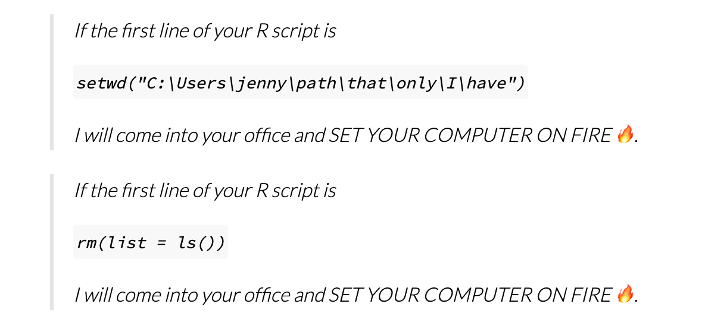

class: center, inverse, middle
# The point of all of this is to
# make your life *easier*

???
Became an accidental professional programmer
Realized needed to learn best practices
NCEAS scientific programmer position
Coding often presented in an "eat your veggies" kind of way
Watching how ecodatascience transformed the coding community at UCSB
---


## Course Structure

.pull-left[
- ~ [1 hour lecture by volunteers](https://docs.google.com/document/d/1S63IHjNBk8e7St6XcyqhVu98qpuRTUx3DHYqzWKYDys/edit)

- ~ 2 hour hands-on activities

- Come to class prepared!
  - We'll send out materials beforehand
  
- If you're not teaching, find a section to help with
  - Present package of the week?

- Learning & community, not expertise!

.center[*Keep an open mind*]
]
.pull-right[


]

---

class: center, inverse, middle
# Getting the Materials


---

# Accessing Lecture Materials

We're going to use GitHub for [this class](https://github.com/super-advanced-r-fall-2019)
  - Apologies to team BitBucket
  - Principles helpful either way!
  - One repo per lecture
  - All materials needed to recreate materials in repo

"Best" way to get materials
  - Create class folder on your machine
  - Fork repo to your github account
  - Clone to the folder on your computer
  - Rebase from master to get any changes
  - Lee Qi will make this all clear

Perfectly fine way to get materials
  - Create class folder on your machine
  - Go to repo
  - Click "Clone or download"
  - Download zip file to class folder

---

# Accessing Lecture Materials

 Presentations will generally be written in R Markdown. 
 
 You can view the raw .Rmd files in the "presentations" folder
 
 Different presenters may have difference presentation formats, but if html, just open the .html file of the presentation with your favorite browser!

---

class: center, inverse, middle

# Project-Oriented Workflows

---


class: center, inverse, middle
# Science is all about reproducibility! 
# Why should it stop at our code?

???
Most of us trained in things like field methods: I've had way more classes in transect methods than coding practices.

Leads to methods that describe the brand of PVC pipe used but depend on a pile of code that will only work on the users computer for the week they submitted the paper, and never again

we put all this work into getting the data, and then drop the ball at the step that turns all that hard work into insight. 

As code becomes our primary tool, need to apply the same reprodicibility rigorous to our code that we're used to applying in our field methods
---


# Project-Oriented Workflows

>This convention guarantees that the project can be moved around on your computer or onto other computers and will still “just work” `r tufte::quote_footer('--- Jenny Bryan')`

- All files needed to run your analysis in one folder
  - Nested subfolders as needed
  - **Does not have to be RStudio**

- All analysis written assuming
  - Fresh state
  - Working directory set to project directory


---

# Project-Oriented Workflows
see [Good Enough Practices in Scientific Computing](https://journals.plos.org/ploscompbiol/article?id=10.1371/journal.pcbi.1005510)


---


# My `setwd` Rant

<!--  -->

`r tufte::quote_footer('--- Jenny Bryan')`

---


# What's wrong with `setwd`?

.pull-left[
### Workflow

*Personal decisions*

* Choice of IDE

* CaMel or snake_case
  - But seriously, snake_case
  - See [tidyverse style guide](https://style.tidyverse.org/)

* Your lucky coding socks

* **Where the code lives**
]
.pull-right[

### Product

*What the analysis needs*

* The data

* Packages

* Package versions

* Custom functions

* Scripts  to tie it all together

]

---

## Alternatives to `setwd`

Using RStudio is a simple way around this
  
  - Create .Rproj file in the root directory of your project
  
Alternatively...
 
  - Often just open a file in the project directory with R GUI/Atom/Whatever
  

  - If that fails, use `cd` / `setwd` from the command line/console (not in your script) when you open your analysis
  
  - `here` will often do the job for you
  

Using project-oriented workflow means that once you're in the working directory, everything else should work


**It's the user's, not the code's, responsibility to make sure the working directory is set correctly** $^1$

.footnote[
[1] But do what works best for your workflow
]

---

## Use the `here` package

The [`here`](https://here.r-lib.org/) package helps create platform-proof paths, and will help `setwd`


Uses heuristics involving files like .Rproj, .git, .here to find project root

```{r}
library(here)
```

Builds paths from there

```{r}
here::here("data","my_data.csv")
```

Works on any platform, and inside R Markdown chunks!

---

# USE VERSION CONTROL
## In other words, use `git` (and I like github)

You will thank yourself when you break everything right before a deadline and can use git as a magic time machine. 

Also prevents emailing of "project_code_v3 DO edits_09-12-2020-FINAL.R"

We'll cover this in a dedicated lecture, but for any kind of collaborative or solo work, git and github will be your friend

See Lee Qi's intro to git and github [here](https://rawcdn.githack.com/super-advanced-r-fall-2019/git-and-github/b0edfd029e1a4c87c1302386f335148dc2647f6b/presentations/git-and-github.html)

---

# On with the Show

.pull-left[

.middle[Use this class as an opportunity to learn new tools and improve your overall coding practices. 

Thanks for joining!
]

]
.pull-right[


```{r, echo=FALSE, out.height="400px"}
# knitr::include_graphics("https://github.com/super-advanced-r-fall-2019/intro/raw/master/imgs/good_code.png")
```

]


---
